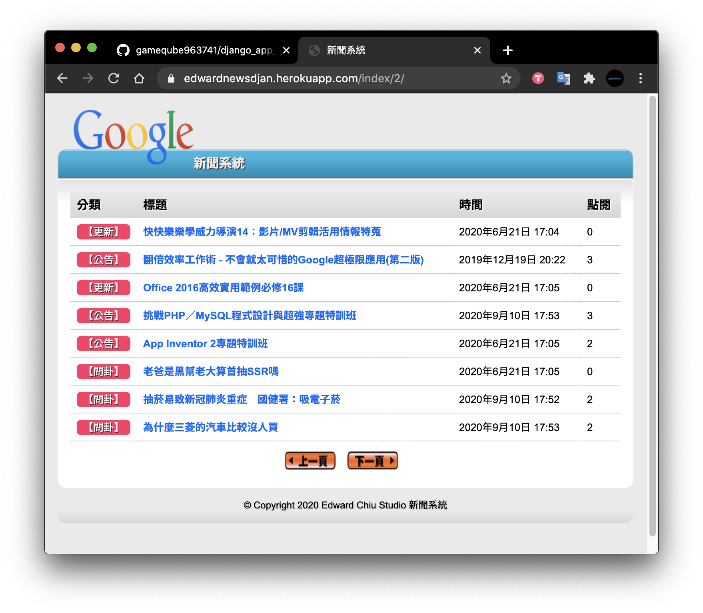

# Django to Heroku
1. pip install pipenv 
2. pipenv --python 3.7.8
3. pipenv shell
4. pip3 install -r requirements.txt(or pipenv install '--use--pipfile--') 

5. create Procfile
6. create runtime.txt
7. create prod_settings.py
8. create .gitignore

9. heroku login
10. git init
11. heroku git:remote -a rep-name
12. heroku config:set DJANGO_SETTINGS_MODULE=news.prod_settings
13. git add .
14. git commit 'msg'
15. git push heroku master 

# heroku 連接畫面 新聞app

